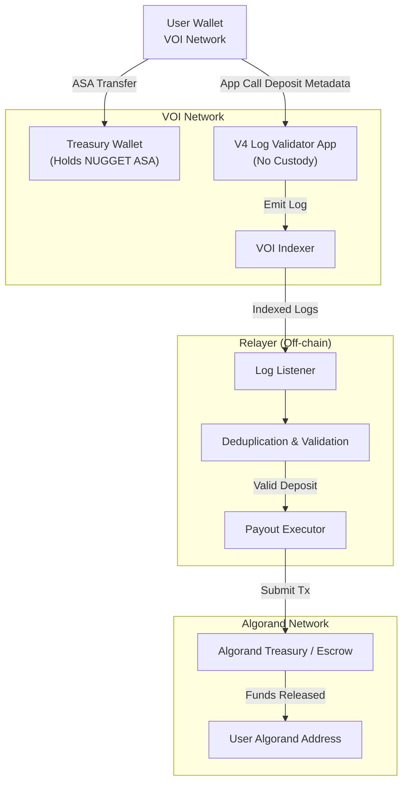

# VOI--ALGO
VOI to Algorand Mainnet Bridge

Needs finishing and tweaks need to follow, should be done by end of the first week in Jan 2026

This is the new design - its coming - scripts currently are now outdated.

